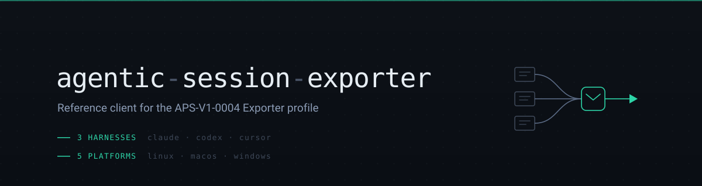

<p align="center">
  
</p>

<p align="center">
  <a href="https://github.com/AgentParadise/agentic-session-exporter/actions/workflows/ci.yml"></a>
  <a href="https://github.com/AgentParadise/agentic-session-exporter/actions/workflows/release.yml"></a>
  <a href="https://github.com/AgentParadise/agentic-session-exporter/releases"></a>
</p>

<p align="center">
  <a href="LICENSE"></a>
  
  
  
  <a href="#the-standard-this-implements"></a>
</p>

# agentic-session-exporter

Back up your agent sessions.

Claude Code, Codex, and Cursor each write transcripts to your disk in their own
format, where they stay until you lose the machine. This command reads them,
wraps each one in a standard envelope that keeps the original bytes untouched,
and uploads it to a session store you choose. Your sessions become searchable,
attributable, and resumable somewhere else.

It runs on a laptop, on a server, or inside a container, and it needs no daemon
and no runtime installed.

It implements a public standard rather than a product, so it depends on the
standard and on no store at all. Point it at whichever store you run, or write
your own receive side against the same spec.

## The standard this implements

**[APS-V1-0004 - Session Capture](https://github.com/AgentParadise/agent-paradise-standards-system/tree/main/standards/v1/APS-V1-0004-session-capture)**

That identifier is opaque until you have seen one, so briefly: APS-V1-0004 is a
public specification from the [Agent Paradise Standards
System](https://github.com/AgentParadise/agent-paradise-standards-system). It
answers one question - *what does a captured agent session look like, so
that any tool can write one and any store can read it* - and it answers it
without requiring anyone to agree on a provider's internal transcript format.

The core idea is a thin **envelope**: a small set of fields a store can sort,
deduplicate and attribute by (who, when, where from, which agent), wrapped
around the provider's raw transcript preserved **byte for byte**. Because the
standard never claims to understand a provider's internals, it cannot rot when
those internals change.

It defines three conformance profiles:

| Profile | Meaning |
| --- | --- |
| **Source** | read a provider's local transcripts into envelopes |
| **Exporter** | push envelopes to a store's batch endpoint |
| **Reconstitutor** | write a stored session back to disk and resume it natively |

**This repository is the reference implementation of the Exporter profile** (and
of Source, since it has to read transcripts to export them). A store implements
the receive side. Neither depends on the other - both depend on the
standard, which is the entire point: you can swap either half without the other
noticing.

Worth reading if you are integrating: the
[specification](https://github.com/AgentParadise/agent-paradise-standards-system/blob/main/standards/v1/APS-V1-0004-session-capture/docs/01_spec.md)
and the
[envelope JSON Schema](https://github.com/AgentParadise/agent-paradise-standards-system/blob/main/standards/v1/APS-V1-0004-session-capture/schemas/session-envelope.schema.json).

## Quick start

Capture the sessions already on your machine:

```bash
# Where to send them.
export SESSION_STORE_URL="https://sessions.example.com"
export SESSIONS_WRITE_TOKEN="..."          # omit for an unauthenticated store

# Who is sending them. Both optional, both worth setting.
export SESSION_STORE_ORIGIN_ENV="laptop"   # default: laptop
export SESSION_STORE_ORIGIN_HOST="$(hostname)"
export SESSION_STORE_ORIGIN_DEPLOYMENT=""  # optional: which deployment, e.g. myapp__prod

apss-session-exporter --dry-run            # show what it would send, send nothing
apss-session-exporter                      # sweep and upload
apss-session-exporter --health             # can it reach the store?
```

It finds transcripts in each harness's usual location, so there is normally
nothing else to configure. Re-running is always safe: the store deduplicates on
content hash, so nothing uploads twice.

### Say where the sessions came from

`SESSION_STORE_ORIGIN_ENV` and `SESSION_STORE_ORIGIN_HOST` are what make a
multi-machine corpus readable. They cost one line each and they are the
difference between "3,000 sessions" and "3,000 sessions I can filter".

Leave them unset and every session claims to come from `laptop` on whatever
hostname the machine happens to report. That is fine for one laptop. It stops
being fine the moment a second source appears, and it is actively misleading in
a container, where the hostname is a short-lived container id that will never be
seen again.

Pick values and keep them stable, because a store groups on the exact string:

```bash
# A developer machine
export SESSION_STORE_ORIGIN_ENV="laptop"

# A long-lived box
export SESSION_STORE_ORIGIN_ENV="vps"
export SESSION_STORE_ORIGIN_HOST="build-01"

# CI or an orchestrated workspace: name the DEPLOYMENT, and set the host to
# something that outlives the container, such as the worker node.
export SESSION_STORE_ORIGIN_ENV="myapp__prod"
export SESSION_STORE_ORIGIN_HOST="worker-07"
```

**`ORIGIN_ENV` is a namespace, not an enum.** It is a free string, so you can put
a hierarchy in it, and the `<app>__<tier>` shape above is exactly that: two
levels separated by a double underscore.

```
laptop                    one level,  no app
myapp__prod               two levels, app and tier
myapp__prod__eu           three,      if a region matters to you
```

A store splits on the FIRST `__`, so the part before it is the app and
everything after is the tier, however many segments that turns out to be. A
value with no `__` is perfectly valid and renders as a flat group, which is why
plain `laptop` keeps working.

Double underscore rather than a dot or a hyphen because app names and hostnames
routinely contain dots and hyphens, and a separator that appears inside the
values it separates is not a separator.

None of this is enforced by the exporter. It sends the string you give it, and
the convention only pays off if you keep it stable.

### Keep it running

```bash
apss-session-exporter --loop
```

Or drive it from cron, a systemd timer, or a launchd agent. It holds no state
between runs beyond its own state file, so a repeated invocation is always safe.

### Bring a session back

```bash
apss-session-reconstitute <session-id>
```

Writes a stored session back to disk on another machine so the original harness
can resume it.

## Supported harnesses

| Harness | `source_format` | Read from | Override with |
| --- | --- | --- | --- |
| Claude Code | `claude-jsonl-v1` | `~/.claude/projects` | `CLAUDE_PROJECTS_ROOT` |
| Codex | `codex-turns-v1` | `~/.codex/sessions` | `CODEX_SESSIONS_ROOT` |
| Cursor | SQLite state db | Cursor's state database | `CURSOR_STATE_DB` |

Adding one is meant to be a small, contained change - one module, registered.
See [docs/REQUIREMENTS.md](docs/REQUIREMENTS.md) section 6 for the shape a
harness has to take, and why the rest of the pipeline must not need editing.

## Supported machines

Every release publishes all five, signed, with checksums:

| Platform | Target | Typical use |
| --- | --- | --- |
| Linux x86-64 | `x86_64-unknown-linux-gnu` | workspace containers, servers |
| Linux ARM64 | `aarch64-unknown-linux-gnu` | ARM containers, ARM servers |
| macOS Apple Silicon | `aarch64-apple-darwin` | developer laptops |
| macOS Intel | `x86_64-apple-darwin` | developer laptops |
| Windows x86-64 | `x86_64-pc-windows-msvc` | developer laptops |

A platform that is not built is a platform where capture does not exist, so this
list is a product decision rather than a build detail.

## Install

**From a release** - download the binary for your platform, then verify before
trusting it:

```bash
# One manifest covers every asset; one signature covers the manifest.
cosign verify-blob --signature SHA256SUMS.sig \
  --certificate-identity-regexp 'https://github.com/AgentParadise/agentic-session-exporter/.*' \
  --certificate-oidc-issuer https://token.actions.githubusercontent.com \
  SHA256SUMS
sha256sum --check SHA256SUMS --ignore-missing
```

**Into a container image** - copy from the published OCI image by digest, never
by tag:

```dockerfile
COPY --from=ghcr.io/agentparadise/agentic-session-exporter@sha256:… \
     /apss-session-exporter /usr/local/bin/apss-session-exporter
```

A digest is the only immutable reference. Pinning a tag means an upstream push
silently changes what your image ships.

## Binaries

| Name | Purpose |
| --- | --- |
| `apss-session-exporter` | discover local transcripts, upload envelopes |
| `apss-session-reconstitute` | write a stored session back to disk to resume it |

`SeshMagicSessionExporter` and `SeshMagicSessionReconstitute` are built from the
same sources as **compatibility aliases** for deployments that hardcode the
pre-rename names. They are scheduled for removal in a declared major release,
never silently: an operator whose capture stops with no message is worse off
than one told to rename a file.

The `apss-` prefix is deliberate - this is the reference client of a standard, so
its executables are named for the standard rather than for a vendor or for this
repository.

## Documentation

| | |
| --- | --- |
| [Requirements](docs/REQUIREMENTS.md) | what this repo is held to, and why |
| [Quick start runbook](docs/runbooks/quick-start.md) | first capture, start to finish |
| [Container embedding](docs/runbooks/embedding-in-a-container-image.md) | baking it into a workspace image |
| [Troubleshooting](docs/runbooks/troubleshooting.md) | when nothing is arriving |

## Security

Artifacts are signed with cosign keyless OIDC. The write token is never printed
to stdout, stderr, or a log line - [there is a test for it](tests/cli.rs),
because this binary's output is routinely captured into durable logs by whatever
invokes it.

Report vulnerabilities privately via GitHub Security Advisories.

## License

MIT - see [LICENSE](LICENSE).
